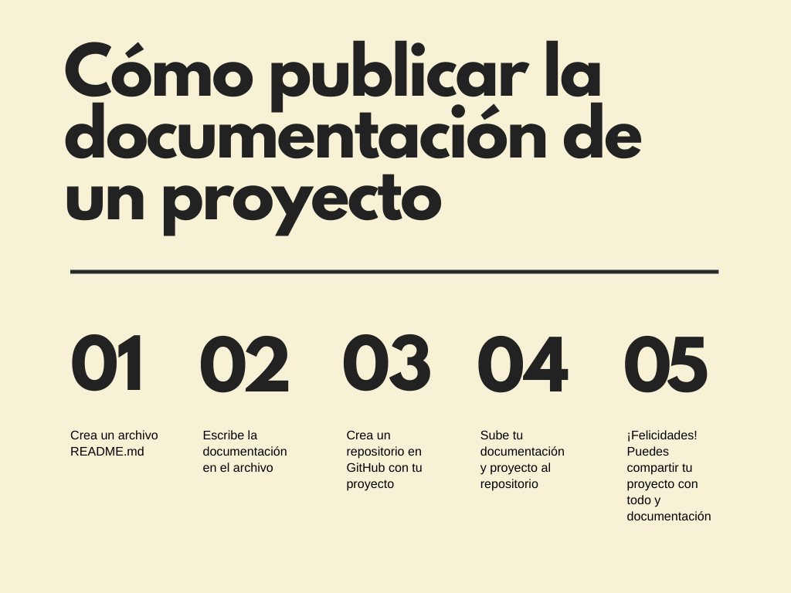
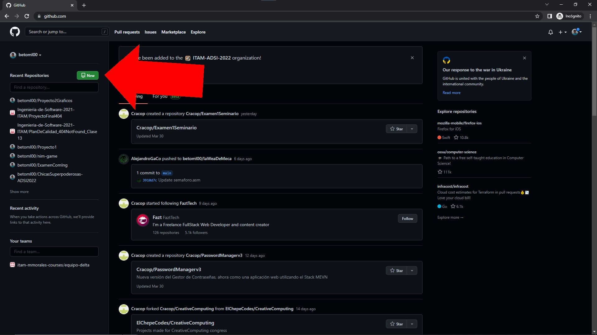
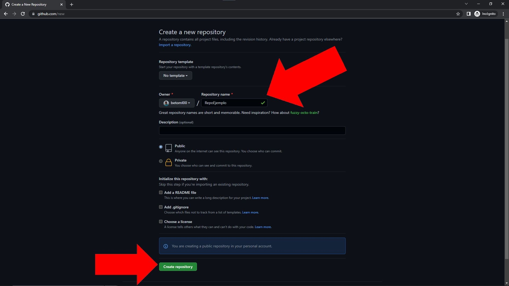
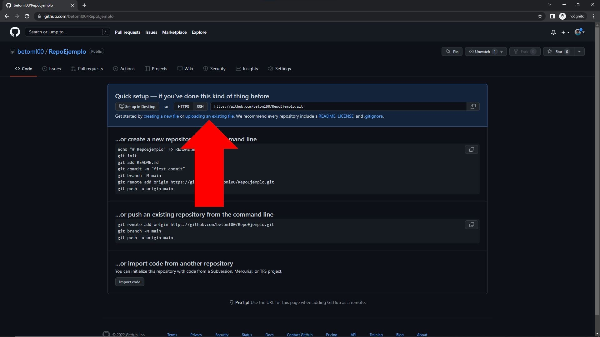
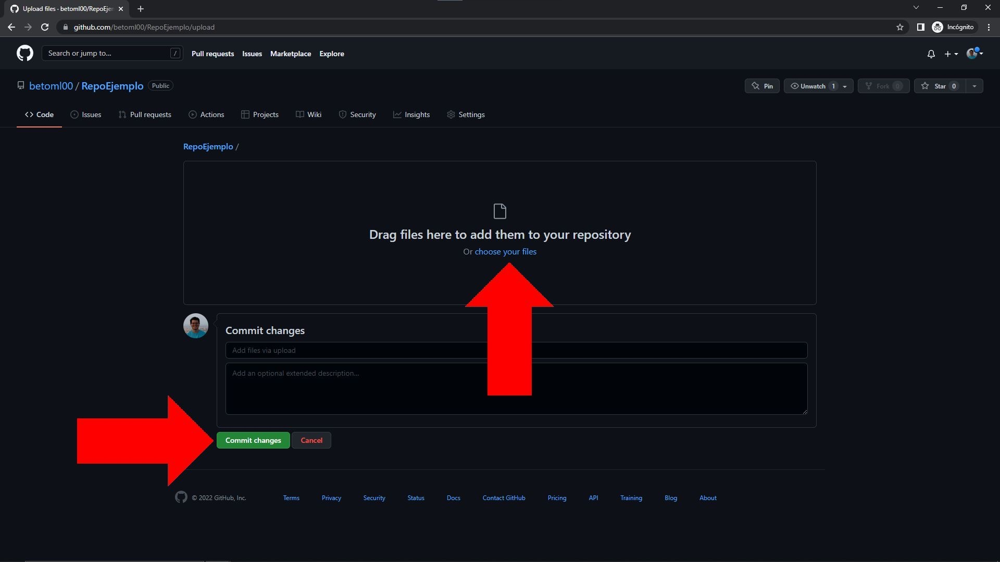

# Cómo publicar la documentación de un proyecto

Esto es una guía para publicar la documentación de **un proyecto que ya tengas hecho** y quieras compartir con más gente. Vamos a usar GitHub para publicar el proyecto con su documentación. Los pasos a seguir son los siguientes:

## 1. Crea un archivo README.md
Para crear un archivo que utilice Markdown, puedes usar cualquier editor de texto sencillo (como el bloc de notas si estás en Windows). También hay aplicaciones alternativas; yo te recomiendo que utilices [Obsidian](https://obsidian.md/). Simplemente crea un nuevo archivo y guárdalo con el nombre `README.md`. Te sugiero que lo guardes en el mismo folder que tu proyecto.

## 2. Escribe la documentación en el archivo que acabas de crear
Si no sabes cómo empezar o qué cosas agregar en tu documentación, te sugiero que revises [A begginer's guide to writing documentation](https://www.writethedocs.org/guide/writing/beginners-guide-to-docs/), una guía escrita por Eric Holscher. Ten en mente que la documentación de un proyecto tiene que ayudar a otras personas (e incluso a ti mismo) a entender mejor cómo y por qué utilizar tu proyecto. Incluso, como sugiere Eric Holsher en la guía que recomendé, te puede servir para que otras personas contribuyan y mejoren tu proyecto. Vale la pena invertir tiempo en este paso.

## 3. Crea un repositorio en GitHub con tu proyecto
1. Navega a la página de [GitHub](https://github.com/).
2. Si no tienes un perfil, crea uno e ingresa haciendo click en "Sign up". Si ya cuentas con un perfil, entonces haz click en "Sign in" y entra con tu usuario y contraseña.
   
3. Haz click en el botón de New.
   
4. Escribe un nombre para tu proyecto y luego presiona "Create Repository". Puedes añadir una descripción si así lo deseas. Ten mucho cuidado de dejar tu repositorio como **público** para que más gente pueda verlo.
   

## 4. Sube tu documentación y proyecto al repositorio
1. Presiona "uploading an existing file".
   
2. Presiona "choose your files".   
3. Selecciona todos los archivos que quieras mostrar en tu repositorio. En particular, asegúrate de seleccionar el archivo `README.md` y, cuando termines de seleccionar, presiona "Abrir".
4. Por último, presiona "commit changes".
   

¡Felicidades! Has subido tu documentación y proyecto a un repositorio en GitHub.